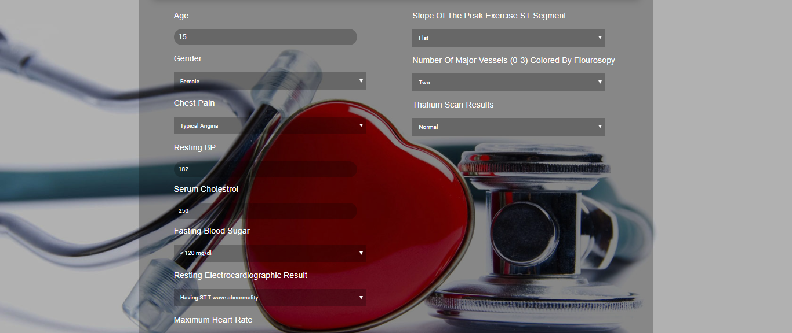

# Heart Disease Prediction System using machine learning
>The aim of this project is to predict heart disease using data mining techniques and machine learning algorithms.This project implements 4 classificiation models using scikit-learn: Logistic Regression, Naïve Bayes, Support Vector Classifier and Decision Tree Model to investigate their performance on heart disease datasets obtained from the UCI data repository.

It supports following features:

*	Login/ Sign Up 
*	Viewing and Editing Profile 
*	User can enter the values of various parameters on the basis of which his risk factor will be calculated using machine learning algorithms.

Quick start
-----------
1. (optional) create virtual env ex. mkvirtualenv mytest_env
2. pip install -r requirements.txt
3. python manage.py migrate
4. python manage.py runserver

